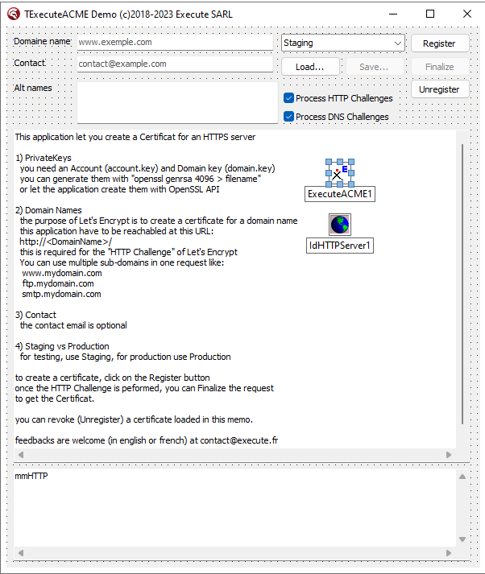

# ACME (Let's Encrypt protocol) component for Delphi
(c)2018-2023 by [Execute SARL](http://www.execute.fr)

## Purpose

TExecuteACME component allows you request a "[Let's Encrypt](https://letsencrypt.org/)" certificate for your domain.

The component supports HTTP and DNS Challenge.

For the HTTP challenge, you can use a self hosted WebServer (TidHTTPServer) to validate the certificate or use the OnHttpChallenge event to store the challenge reply on your website.
In both cases you need to manage the domain's HTTP (not HTTPS) server.

For the DNS challenge you have to add an entry in your domain's DNS (manually or with your own code).

## Installation

this component is compatible with Delphi from at least Berlin up to Alexandria, including the Community Edition.

**New**: this repository contains Alexandria compatible DCU (Win32, Win64 and Linux) for testing purpose only, they accepts only Staging environment.

1. Download the repository
2. Open ACMEGroup.groupproj
3. Right click on the project "Execute.ACMEDesign.bpl" and install it
4. Select the ACMEDemo project
5. Compile and run the Application

the application requires OpenSSL (for Windows : libeay32.dll and ssleay32.dll)
on the first start, the application can create Account.key and Domain.key for you, (generating a 4096bits take some time, this is normal).

Account.key will be your Let's Encrypt account private key, place it on a safe place (with a password).

Domain.key is the private key for the domain (same recommendations).

if you have an error like "SSL routunes:ssl3_read_bytes:tslv1 alert protocol version", you should update the component to version 1.4.
The component used Indy socket, but TLS 1.3 is not supported, so in version 1.4 I've switched to System.Net.HTTPClient
	
## How does it work ?

(you have to do this periodically  because the certificate lives only for 90 days !)

### 1. Self signed certificates
The component needs two certificates, one for the Let's Encrypt account (AccountKey property) and one to sign the requests (DomainKey property).
See the LoadOrCreateKey() function in the demo to create those certificates.
### 2. Registration request
To register a domain, set the DomainName and ContactEMail properties and call RegisterDomain()

	TExecuteACME.RegisterDomain();
	 -> OnHttpChallenge -> this give you the HTTP challenge Token & Thumbprint.
	 -> OnDnsChallenge  -> this give you the DNS challenge Digest
	 -> OnDone          -> the certificate is not ready yet, try later.
### 3a. HTTP Challenge
To validate an HTTP challenge, Let's Encrypt reads the HTTP (not HTTPS) URL below, which should return the Thumbprint value.

	Let's Encrypt -> http://(domain)/.well-known/acme-challenge/(token) <- Thumbprint
### 3b. DNS Challenge
To validate a DNS challenge, Let's Encrypt reads a DNS entry 

	Let's Encrypt -> _acme-challenge.<zoneName> <- Digest
### 4. Retrieve the certificate
When at least one of the two challenges is processed, you can request the certificate with FinalizeDomain()

	TExecuteACME.FinalizeDomain();
	 -> OnCertificate   -> store the updated certificate.
### 4. Revoke certificate (if required)
	 TExecuteACME.UnRegisterDomain();
	 -> OnDone          -> the certificate is revoked.
## version 1.1

Better error handling with error report

SubjectAltNames let you define alternative names for the DomainName

new OrderURL and OrderStatus properties

FinalizeDomain is now used (with OrderURL) to retrieve the last requested Certificate

OnHttpChallenge has a new parameter Processed to let you delay the challenge (call FinalizeDomain when the challenge is ready, the event will be fired again and then you can set Processed to True)

## version 1.2

Support for [POST-as-GET](https://community.letsencrypt.org/t/acme-breaking-change-most-gets-become-posts/71025) protocol change.

## version 1.3

Support for 64bits and Linux

Support for synchronous  calls with *Now methods

## version 1.4

Switch from TidHTTP to System.Net.HTTPClient for TLS 1.3 support. 

## version 1.5

DNS Challenge added

## version 1.6

minor fix for DNS challenges

## Which challenge to use ?

The HTTP challenge is easy to implement; just put a file on you website or embed an IdHTTPServer component to reply dynamically.

The DNS challenge can be more difficult to achieve if you can't make the change by code, but it allows to register wildcards domains like *.mydomain.com.

## License

this repository contains the full source code of the demo application for the CLOSED SOURCE component TExecuteACME.

you'll find the compiled Execute.ACME.dcu unit in the [lib](/lib) folder and the Interface part of the Unit in [Execute.ACME.Interface.pas](lib/Execute.ACME.Interface.pas).

This component is NOT FREE !

You have to [register a license](https://store.execute.fr) to use it in any commercial product

you are NOT allowed to use this component to register a commercial website
certificate without a registered license.

You can [buy the component source code](https://store.execute.fr) for 50&euro; per developper up to 200&euro; (site license).

Minor version updates indefinitely and major version updates for 1 year from date of purchase.

If I sell 100 licenses (5.000&euro;), the component will be released under GPL :)

Even then you'll still be able to buy a commercial license for my part of the component.

Feedbacks are welcome.