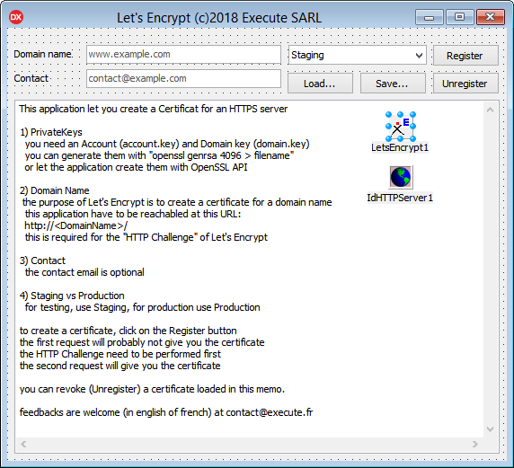

# Let's Encrypt component for Delphi Tokyo
(c)2018 by [Execute SARL](http://www.execute.fr)

## Purpose

TLetsEncrypt component let you request a "[Let's Encrypt](https://letsencrypt.org/)" certificate for you domain.

The component supports HTTP Challenge, you can use a self hosted WebServer (TidHTTPServer) to validate the certificate or use the OnHttpChallenge event to store the challenge reply on your website.

In both case you need to manage the domain's HTTP (not HTTPS) server.

## Installation

this component is compatible with Delphi Tokyo 10.2.3 (even the Community Edition).

1. Download the repository
2. Open LetsEncryptGroup.groupproj
3. Right click on the project "Execute.LetsEncryptDesign.bpl" and install it
4. Select the LetsEncryptDemo project
5. Compile and run the Application

the application requires OpenSSL (libeay32.dll and ssleay32.dll)
on the first start, the application can create Account.key and Domain.key for you, (generating a 4096bits take some time, this is normal).

Account.key will be your Let's Encrypt account private key, place it on a safe place (with a password).

Domain.key is the private key for the domain (same recommandations).
	
## How does it work ?

### 1. Registration request
	TLetsEncrypt.RegisterDomain();
	 -> Account.key     -> register a Let's Encrypt account.
	 -> Domain.key      -> send a Certification Signing Request.
	 -> OnHttpChallenge -> store the challenge Token & Thumbprint.
	 -> OnDone          -> the certificate is not ready yet, try later.
### 2. HTTP Challenge
	Let's Encrypt -> http://(domain)/.well-known/acme-challenge/(token) <- Thumbprint
### 3. Retrieve the certificate
(you have to do this periodically  because the certificate lives only for 90 days !)

	TLetsEncrypt.RegisterDomain();
	 -> Account.key     -> Retrieve account status.
	 -> Domain.key      -> Retrieve the Certificate from Let's Encrypt.
	 -> OnCertificate   -> store the updated certificate.
### 4. Revoke certificate (if required)
	 TLetsEncrypt.UnRegisterDomain();
	 -> Domain.key      -> Revoke Certificat
	 -> OnDone          -> the certificate is revoked.
## Licence

this repository contains the full source code of the demo application for the CLOSED SOURCE component TLetsEncrypt.

you'll find the compiled Execute.LetsEncrypt.dcu unit in the [lib](/lib) folder and the Interface part of the Unit in [Execute.LetsEncrypt.Interface.pas](lib/Execute.LetsEncrypt.Interface.pas).

This component is NOT FREE !

You have to register a licence to use it in any commercial product

you are NOT allowed to use this component to register a commercial website
certificate without a registered licence.

You can buy the component source code for 50&euro; per developper up to 200&euro; (site licence).

Minor version updates indefinitely and major version updates for 1 year from date of purchase.

If I sell 100 licences (5.000&euro;), the component will be released under GPL :)

Even then you'll still be able to buy a commercial licence for my part of the component.

Feedbacks are welcome.